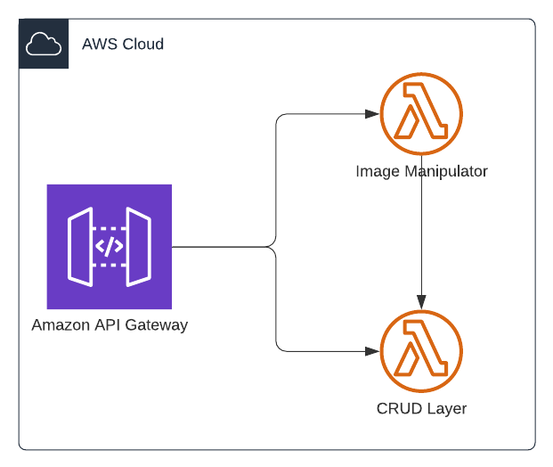

# Form Builder Application

We would like to drag & drop forms online, print them and scan them to take results back.

## Backend

This product consists of multiple microservices:

1. Image Manipulator (Python in a Lambda)

Image manipulator is responsible for handling images that are uploaded to the service. Handling includes:

- Resizing, flattening
- OCR (optical character recognition)
- Extract data associated with each part, call CRUD layer with the extracted data.

2. CRUD layer (Express server with Lambda)

Gets form id, and its components along with the data. Saves them to DB.

## Web App

Create forms with drag & drop UI, share them as online forms with a link.

- Print forms for distributed in paper.
- Can also fill out forms online.
